# Ozon Route256 2024 слив задач
Слив не слив (хотя подготовительный раунд я весь прорешал), но это скорее всего самый высокочастотный запрос
по тематике связанной с этим конкурсом. Также я сохранил все тексты задач, если захочешь подготовиться и
увидеть реальные задачи, сохранил распределение призовых баллов и провёл небольшую аналитику.
Если у тебя прорешаны другие задачи — скинь их либо через MR, либо в issue,
либо в группу в телеге в конце текста.

## Тренировочный раунд Route 256: Middle Go-разработчик (Август 2024)
**1 О новых форматах заданий** ([код](practice_round/1.go)) 5 баллов  
Просто вывести "ОК"

**2 [Ошибка округления](practice_round/2/)** ([код](practice_round/2/2.go), полностью решена) 5 баллов  
Округление до произвольной точности, и потом форматированный вывод

**3 [Корень дерева](practice_round/3/)** ([код](practice_round/3/3.go), полностью решена) 10 баллов  
Сначала заморочный ввод потомков в графе, потом с помощью сортировки нахожу отсутствующий элемент в массиве.
Отсутствующий элемент можно найти быстрее и хитрее — из суммы арифметической последовательности
вычитаешь сумму номеров потомков в графе, и получится номер вершины, которая не была ни у кого потомком.

**4 [Сломанный сервер](practice_round/4/)** ([код](practice_round/4/4.go), полностью решена) 15 баллов  
Самая длинная последовательность из 2-х символов. Надо помнить длину последовательности из одного символа

**5 [JSON prettify](practice_round/5/)** ([код](practice_round/5/5.go), полностью решена) 20 баллов  
Вводим многострочный JSON, потом циклично регуляркой из него выпиливаем пустые элементы

**6 [Упаковка коробок](practice_round/6/)** ([код](practice_round/6/6.go), полностью решена) 30 баллов  
Просто список какое количество каких коробок, и одна функция, которая «загружает» машину под завязку, от больших к меньшим

**7 [Похожие логины](practice_round/7/)** ([код](practice_round/7/7.go), полностью решена) 35 баллов  
Хэш-функция не чувствительная к расположению букв, входные строки хранятся в массиве массивов строк по хэшу.

**8 [Добыча природных ресурсов](practice_round/8/)** ([код](practice_round/8/8.go), полностью решена, но с грязным хаком) 40 баллов  
Боль, страдания и наебалово. Перебор самых редких вершин, потом перебираешь остальные, пытаешься найти какой-то оптимальный маршрут.

Кстати после трёх удачных загрузок выскакивает такое сообщение:

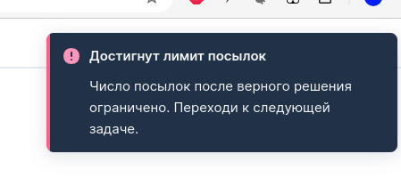

## Основной раунд Route 256: Middle Go-разработчик (Август 2024)

**1 [Удалить цифру из числа](main_round/1/)** ([код](main_round/1/1.go), полностью решена), 5 баллов  
Формулировка задачи отдаёт токсичным наймом, но цифры в тестах не помещаются ни в один числовой тип. Решил на строках.

**2 [Деление массивов](main_round/2/)** ([код](main_round/2/2.go), частично решена), 10 баллов  
Подлость задачи, что получается число нереальных размеров, которое не влезает в числовые типы. Если просто каждый раз брать остаток от деления результата на 1000000007 (это простое число),
то получишь частичное решение. Но при полном решении возникает умножение чисел близких к 1000000007, которое переполнит любой тип. Полное решение скорее всего либо
в использовании библиотеки для произвольных чисел (math/big), либо в формуле для остатков *x⋅y mod m = (m-x)⋅(m-y) mod m* ([видос](https://www.youtube.com/watch?v=J3RTFwTkxkc)).
Я слишком долго искал варианты решения, вместо попыток решения остальных задач.

**3 [ProductID](main_round/3/)**, 15 баллов  
Ждёт своего героя

**4 [Валидация ответа](main_round/4/)**, 20 баллов  
Ждёт своего героя

**5 [YAML to INI](main_round/5/)**, 25 баллов  
Ждёт своего героя

**6 [Зеркальные пары](main_round/6/)**, 30 баллов  
Ждёт своего героя

**7 [Крестики-нолики (Middle)](main_round/7/)**, 35 баллов  
Ждёт своего героя

**8 [Галерея искусств (Middle)](main_round/8/)**, 40 баллов  
Ждёт своего героя

## Всякие размышления и выводы
Я сохранил здесь лидерборды для [основного](liderboard_main.md) и [тренировочного](liderboard_practice.md) раунда, также сделал [таблицу](liderboard_correlation.md),
где можно посмотреть место человека в обоих раундах одновременно. Самые любопытные могут копировать себе [гугл-таблицу](https://docs.google.com/spreadsheets/d/1bv2IXbdzlgA1__IUbkhlwN6Bhw5Z8_IGExueZilLH10/edit?gid=223706900#gid=223706900) (часть промежуточных листов скрыта),
где я рисовал все эти графики (оттуда удобно копировать формулы в ячейках).

Распределение баллов выглядит следующим образом:

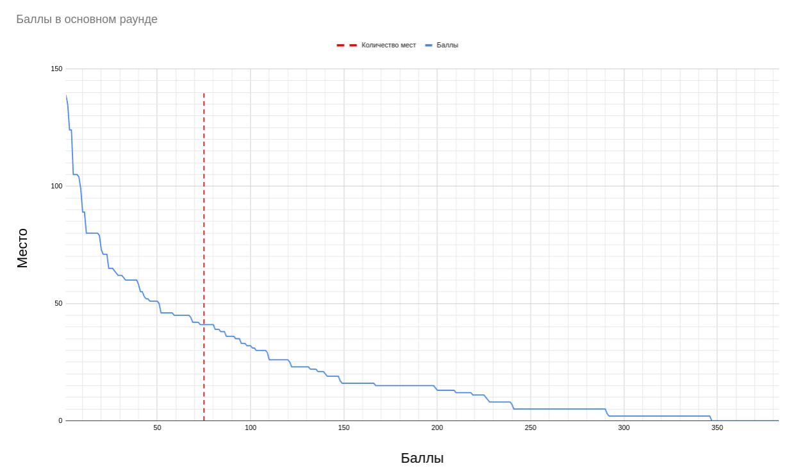

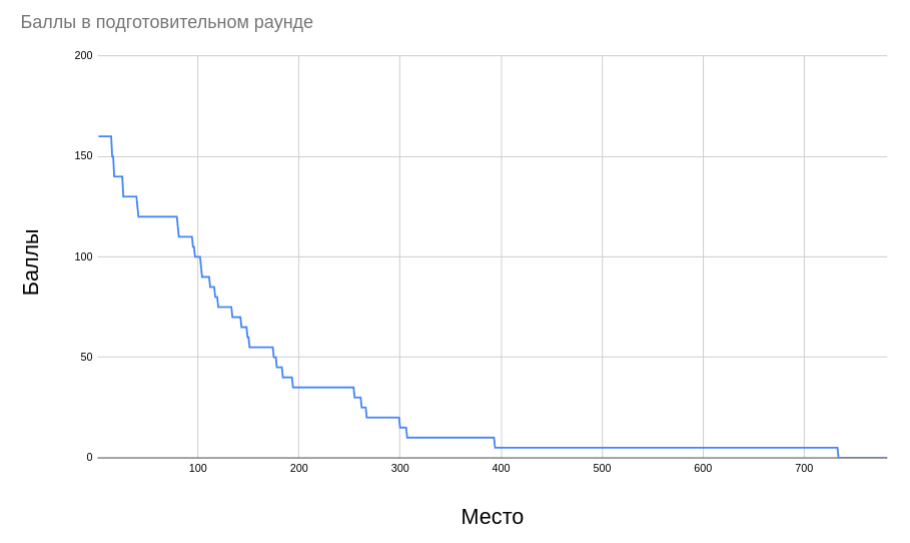

Т.к. задачи дают разное количество баллов, то посмотрим на количество решённых задач:

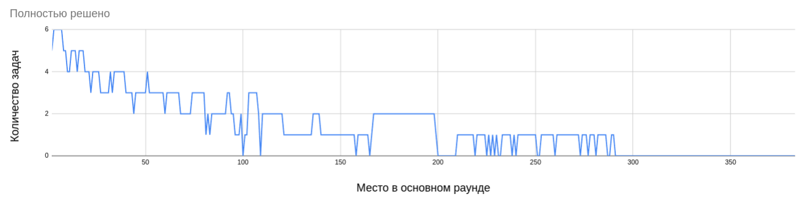

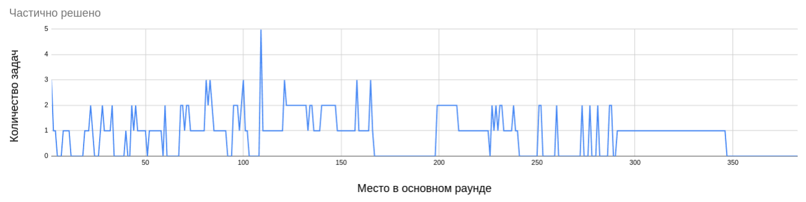

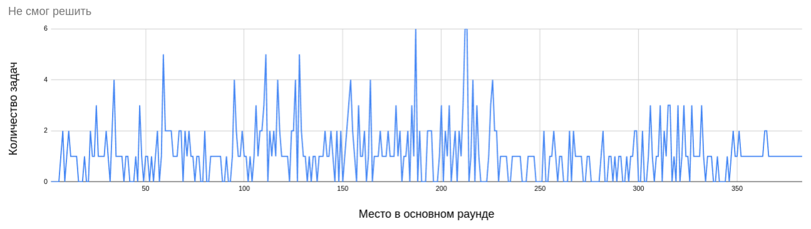

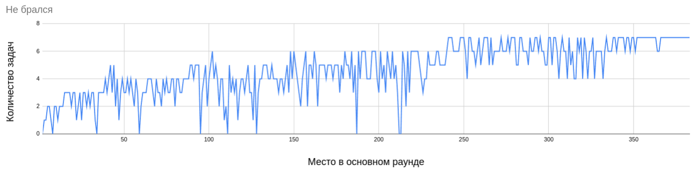

Больше всего здесь выделился человек с ником *kind_vulture_18828* на 109 месте, который умудрился решить 5 задач частично. Просто гений посредственных решений.
В целом количество решённых задач растёт нелинейно, и к первым местам значительно убывает количество задач, за которые вообще не брались. Может быть выше уровень
конкурсанта, может выигрышней тактика попробовать больше задач. Далее рассмотрим корреляцию между местами в раундах, она практически отсутствует (если
место 800 - значит человек вообще не участвовал в подготовительном раунде)

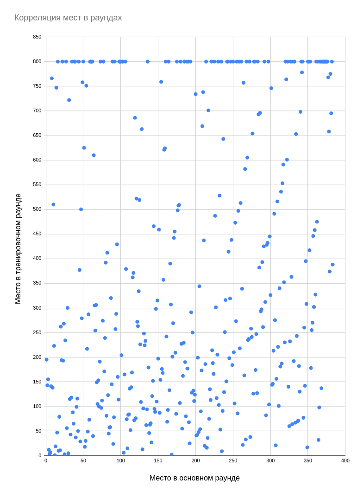

По моим ощущениям задачи в основном раунде были значительно сложнее чем в подготовительном, что демотивировало. Какая задача больше всего кормила победителей?

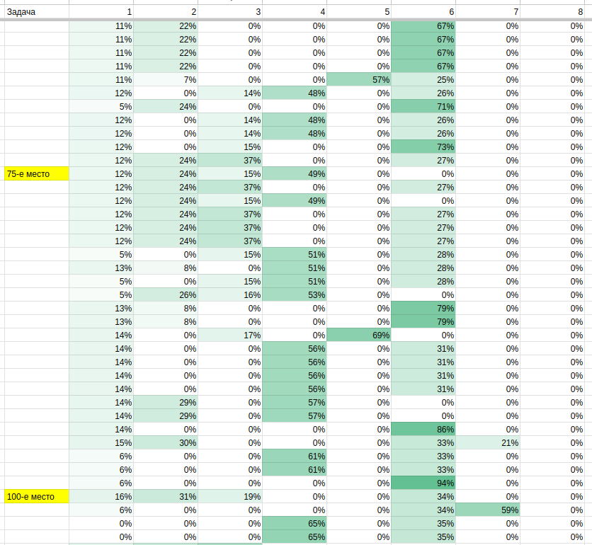

Наибольший вклад давала шестая задача, до 73 процентов результата. А если учесть, что скорее всего часть из первых 75 конкурсантов не будут устраиваться на курсы, а значит и после 75-го места
будут набирать, то вполне вариант решить первую и шестую задачу, и оказаться в выигрыше. Далее посмотрим процент решённых задач среди выигравших и проигравших:

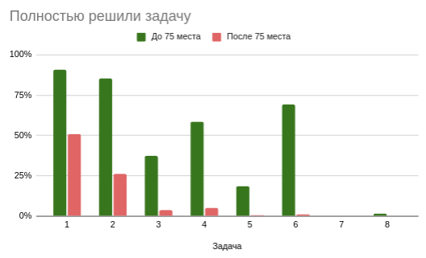

Выпирает первая, вторая, четвёртая и шестая, шестая самая жирная по баллам. Далее частично решённые задачи:

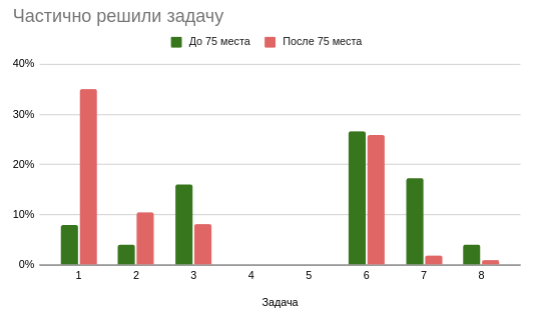

Здесь не вижу ничего существенного. Сильные чаще частично решали сложные задачи, слабые чаще частично решали простые задачи. И только шестую задачу они частично решали поровну.
Далее посмотрим тех, кто потратили на задачу время, и не смогли её решить:

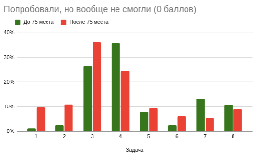

Здесь выпирают третья и четвёртая задача. То есть третья прям паскудная задача — малая вероятность решения, жрёт время, и даёт мало баллов (всего 15, треть от минималки). Теперь соотношение задач, за которые не брались:

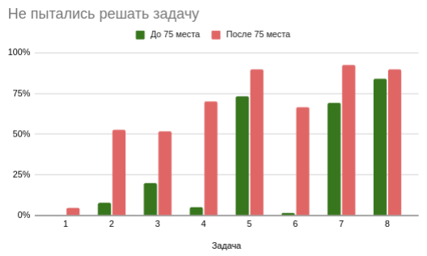

Среди победителей практически нет тех, кто не брались за шестую задачу. Четвёртая тоже значительно выделялась — даже на вторую забивали чаще. А третья наоборот, очень обделена вниманием у победителей.
И дело тут скорее всего как в том приколе — шубка у зайки серенькая не потому, что он так захотел, а потому, что остальные сдохли. Возможно какие-то хорошо подготовленные ребята взялись за третью,
и это перенесло их в группу проигравших.

## Выводы
 - Времени капец как мало, и ты невыспавшийся. Лучше позвать друзей на помощь, тем более задачи можно решать параллельно (только по времени отправки не палиться).
 - Если нанимаешь программеров себе — возможно имеет смысл убрать параллельность, не больше одной задачи одновременно. Так меньше фактора случайности в оценке.
 - Среди победителей (41-е место) есть те, кто не смогли решить ПЕРВУЮ задачу. Тем более она даёт мало баллов. Так что упираться рогом вообще не надо, лучше попробовать больше задач.
 - Задачи матанистые, учась на инженера я с таблицей умножения остатков не сталкивался. Можно нанять в день контеста репетитора по олимпиадным задачам. Или среди родственников его найти.
 - Текст задачи написан на задротском, трудно оценить сложность. Лучше в отдельном файле переводить на человеческий.
 - Если ты нанимаешь программеров себе — пиши понятно, если у вас конечно таски не профессора ставят.
 - Самые интересные задачи — ближе к сложным. Они дают нормально баллов, и их реально решить. Получается в идеале нужно начать с самой сложной задачи, которую ты можешь решить.
 - Решать задачи от меньших к большим — путь к провалу. Чтобы попасть в конец списка победителей нужно идеально решить первые четыре задачи.
 - Даже прочитав задачу нифига не понятно, их надо пробовать решать. А всё это жрёт время. Значит надо пробовать решать (без фанатизма) более сложные задачи, и помечать, что не получилось.
 - Сейчас все общаются в телеге. Я под эту тему создал группу <https://t.me/route256_sliv>, туда можно скинуть способ решения если решил какую-то задачу. Ну или на других конкурсах ищи группы по теме или создавай свою.
 - Отладчик здесь вряд ли поможет, нету времени ковыряться. На прочтение и полное решение каждой задачи не больше часа. Получается тащеры (8 адовых задач за 5 часов) пишут просто в один заход.
 - Если тебя срезали на скорости выполнения — можно воспользоваться профайлером [runtime/pprof](https://go.dev/blog/pprof), чтобы найти узкое место. Я сделал [пример](task_3_with_profiler.go) для третьей задачи.
