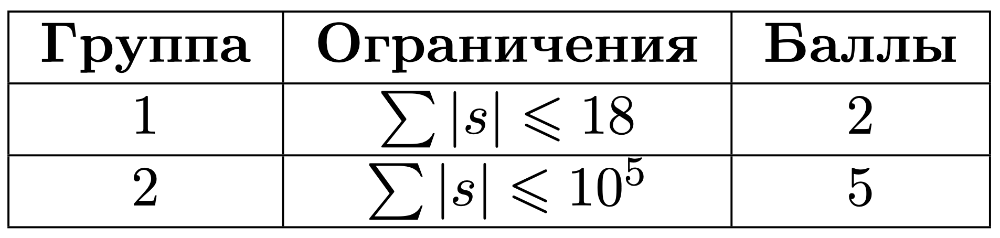

# 1 Удалить цифру из числа

## Условие задачи
Андрей прошел собеседование на позицию разработчика в известном маркетплейсе. И теперь его спросили какую зарплату он бы себе хотел.
Андрей, недолго думая, написал на листочке число — случайный набор цифр, который пришел ему в голову, ведь он знает, чем больше цифр — тем больше число.
В такой зарплате Андрею, к сожалению, отказали. Но его согласились принять на работу при условии, что он сотрет ровно одну цифру из своего числа.

Андрей очень хочет работать в этом маркетплейсе, но также и не хочет много терять в своей зарплате, поэтому просит вас убрать в его числе одну цифру
так, чтобы число осталось как можно больше. Обратите внимание, что если изначальное число содержит всего одну цифру, то убрав ее, Андрей получит число 0.

## Входные данные

Каждый тест состоит из нескольких наборов входных данных.

Первая строка содержит целое число *t (1 ≤ t ≤ 10<sup>5</sup>)* — количество наборов входных данных.

Каждый набор тестовых данных содержит одно целое число *s* — зарплата, указанная Андреем.
Обозначим количество цифр в числе *s* как ∣*s*∣, тогда выполняется 1≤∣*s*∣≤10<sup>5</sup>.
Гарантируется, что число не содержит ведущих нулей, а также сумма количества цифр по всем тестам не превосходит <sup>5</sup>.

 

## Выходные данные
Для каждого набора входных данных выведите наибольшую зарплату, которую может получить Андрей.

## Пример теста 1
**Входные:**
```
1
200000
```
**Выходные:**
```
20000
```

## Пример теста 2
**Входные:**
```
3
9
0
9123
```
**Выходные:**
```
0
0
923
```

## Результат
 
