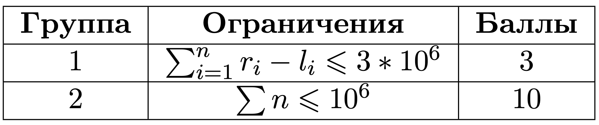

# 2 Деление массивов

## Условие задачи
Антон учит Степана делить массивы одинаковой длины *n* друг на друга следующим образом:
если *a<sub>i</sub>* нацело делится на *b<sub>i</sub>* для всех *1≤i≤n*, то массив *a*
делится на массив *b*.

В качестве упражнения, Степан всегда использует массив *[1,2,…,n]*
в качестве делителя. Теперь он хочет посчитать количество возможных массивов
*a*, которые делятся на заданный делитель. Но Антон догадался, что таких массивов бесконечно много,
поэтому для Степана он наложил на построение массива *a* следующие ограничение: *l<sub>i</sub> ≤ a<sub>i</sub> ≤ r<sub>i</sub>*
для всех *1≤i≤n*, где *l* и *r* — подготовленные заранее Антоном массивы.

Но после введения таких ограничений, посчитать ответ оказалось слишком трудно, поэтому ребята просят вас им помочь.

## Входные данные
Каждый тест состоит из нескольких наборов входных данных.

Первая строка содержит целое число *t (1≤t≤10<sup>5</sup>)* — количество наборов входных данных.

Далее следуют описания наборов входных данных.

Первая строка каждого набора входных данных содержит целое число *n (1≤n≤10<sup>5</sup>).

Вторая строка каждого набора входных данных содержит n целых чисел *l<sub>i</sub> (1≤l<sub>i</sub>≤10<sup>9</sup>) — массив *l*.

Третья строка каждого набора входных данных содержит *n* целых чисел *r<sub>i</sub> (1≤r<sub>i</sub>≤10<sup>9</sup>) — массив *r*.

Гарантируется, что сумма *n* по всем наборам входных данных не превосходит *10<sup>5</sup>*.

 

## Выходные данные
Для каждого набора входных данных выведите количество возможных вариантов массива *a* при заданных ограничениях.
Так как ответ может быть очень большим, выведите остаток от деления ответа на *10<sup>9</sup>+7*.

В первом примере для заданных ограничений существует 4 подходящих массива: [1, 2, 3], [1, 4, 3], [2, 2, 3], [2, 4, 3].

В третьем примере ответ равен 41916958083, но так как вывести нужно остаток от деления на *10<sup>9</sup>+7*,
получаем *41916958083 mod(10<sup>9</sup>+7) = 916957796*.

## Пример теста 1
**Входные:**
```
3
3
1 1 1
2 5 5
5
1 2 7 10 20
1 4 10 30 40
4
1000 1000 1000 1000
2000 2000 2000 2000
```
**Выходные:**
```
4
50
916957796
```

## Результат
 
 - - - -
 После дорешивания:  

 - - - -

