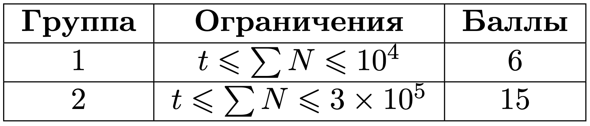

# 3 ProductID

## Условие задачи
Вы разрабатываете систему маппинга товаров в идентификаторы. Идентификаторы товаров могут меняться. Кроме того, система должна показывать, какой был идентификатор у данного товара в данный момент времени в прошлом.

Формально, система получает один запрос в каждую секунду от первой до *n*-й.

Запрос *CHANGE name id* назначает (или меняет) товару с именем *name* идентификатор *id*.
Если в данный момент существует товар с идентификатором *id*, то его идентификатор сбрасывается.

Запрос *GET id time* должен показать, товар с каким именем имел идентификатор *id* после выполнения запроса в секунду под номером *time*.

## Входные данные
Каждый тест состоит из нескольких наборов входных данных.

Первая строка содержит целое число  *t (1 ≤ t ≤ 3⋅10<sup>5</sup>)* — количество наборов входных данных.

Далее следуют описания наборов входных данных.

Первая строка каждого набора входных данных содержит одно целое число *n (1 ≤ n ≤ 3⋅10<sup>5</sup>)* — количество запросов к системе.

Следующие *n* строк каждого набора входных данных содержат по одному запросу к системе в одном из двух форматов:
 - *CHANGE name id*, при этом *name* состоит из строчных латинских букв или цифр, непустой и имеет длину не более 10;*1≤id≤10<sup>5</sup>*.
 - *GET id time*, при этом *1≤id≤10sup>5</sup>; *time<i*, где *i* — текущая секунда.

Гарантируется, что сумма *n* по всем наборам входных данных не превосходит 3⋅10<sup>5</sup>.



## Выходные данные

Для каждого запроса *GET* выведите соответствующее имя товара.
Если в заданный момент времени нет товара с таким *id*, выведите 404.

## Пример теста 1
**Входные:**
```
2
2
CHANGE product1 10
GET 10 1
6
CHANGE product1 10
CHANGE product1 20
GET 10 1
GET 10 3
CHANGE product2 20
GET 20 5
```
**Выходные:**
```
product1
product1
404
product2
```
