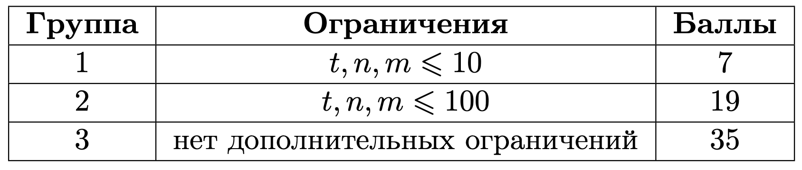
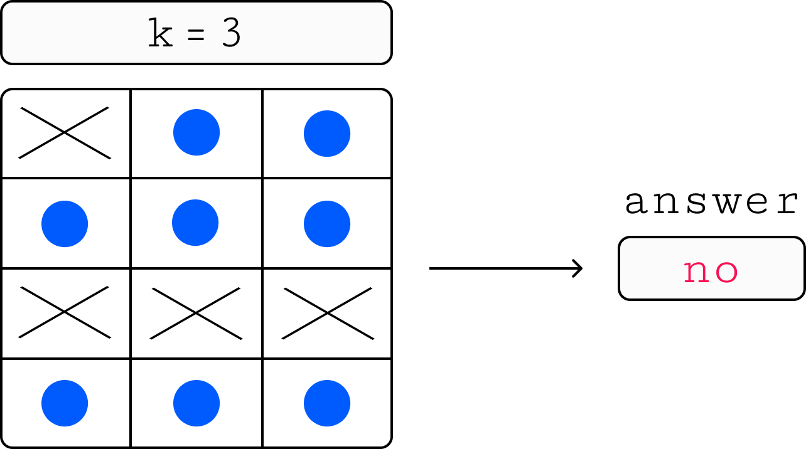
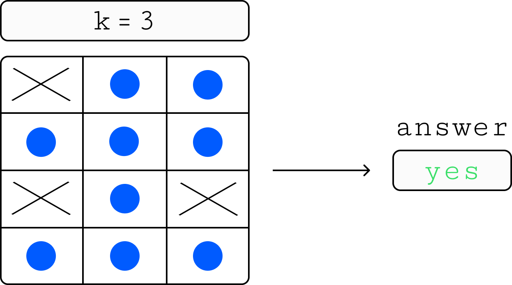
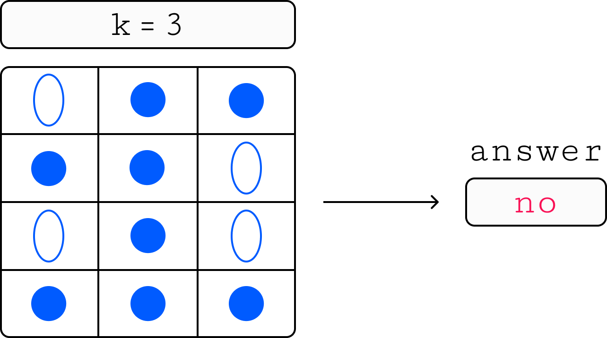
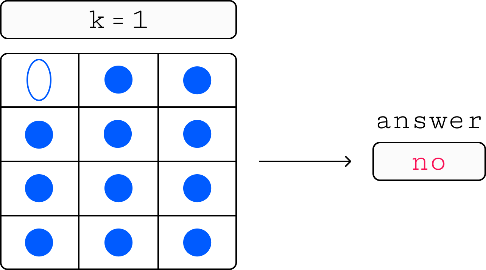

# 7 Крестики-нолики (Middle)

## Условие задачи
Перед вами расширенная версия игры крестики-нолики.

В привычной всем игре победившим считается тот, кто собрал первым последовательность из трёх крестиков или ноликов в одной строке, столбце или диагонали на доске из трёх строк и трёх столбцов.

В расширенной версии игры победителем считается тот, кто собрал первым последовательность из *k* крестиков или ноликов на доске из *n* строк и *m* столбцов.

Ваша задача — по доске с некоторым (не обязательно корректным) состоянием игры понять, можно ли поставить ровно один крестик так, чтобы крестики победили.
Например, если в данном состоянии доски уже есть последовательность из хотя бы *k* крестиков или ноликов, то победитель уже есть, а значит, ровно один крестик для победы поставить нельзя.

## Входные данные
Каждый тест состоит из нескольких наборов входных данных.

Первая строка содержит целое число *t (1 ≤ t ≤ 10<sup>3</sup>)* — количество наборов входных данных.

Далее следуют описания наборов входных данных.

Первая строка каждого набора входных данных содержит одно целое число *k (1 ≤ k ≤ 10<sup>5</sup>)* — необходимая для победы длина строки, столбца или диагонали.

Вторая строка каждого набора входных данных содержит два целых числа *n* и *m (1 ≤ n ≤ 10<sup>4</sup>, 1 ≤ m ≤ 10<sup>7</sup>)* — количество строк и столбцов на доске.

Следующие *n* строк каждого набора входных данных содержат по *m* символов в каждом, где *X* обозначает крестик, *0* обозначает нолик, а . (точка) обозначает пустую клетку.

Гарантируется что суммарный размер досок по всем наборам входных данных не превосходит 10<sup>7</sup>, то есть 
*∑n⋅m≤10<sup>7</sup>*.



## Выходные данные
Для каждого набора входных данных выведите *YES*, если можно поставить ровно один крестик для победы, иначе выведите *NO*.



-------



-------



-------




## Пример данных
**Входные:**
```
3
3
3 3
X..
..O
OOX
2
5 3
...
O.O
X.O
...
...
3
5 5
X.X..
.....
.OX..
..O..
...O.
```
**Выходные:**
```
YES
NO
NO
```
