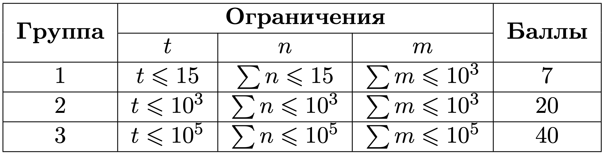
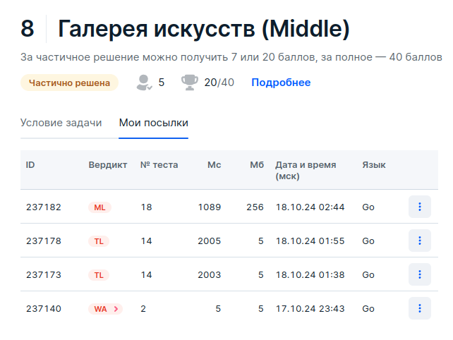

# 8 Галерея искусств (Middle)

## Условие задачи
В королевстве Артистия готовится грандиозная выставка, которая пройдет в знаменитой Галерее искусств.
Мастера со всего королевства прислали свои лучшие картины, и кураторам выставки предстоит сложная задача — разместить
все произведения искусства в специальные защитные коробки, чтобы транспортировать их в галерею.

У вас есть *n* коробок разного размера, каждая с определенной шириной *a<sub>i</sub>* и длиной *b<sub>i</sub>*.
Также у вас есть *m* картин, каждая с заданными шириной *c<sub>j</sub>* и длиной *d<sub>j</sub>*.
Каждая картина должна быть упакована в коробку, в которую она полностью вмещается
(минимальная и максимальная стороны картины должны быть меньше либо равны минимальной и максимальной сторонам коробки соответственно),
при этом коробки могут уместить неограниченное количество картин.

Вам необходимо найти способ упаковать все картины, используя минимальное количество коробок, чтобы все картины благополучно достигли Галереи искусств.

## Входные данные
Каждый тест состоит из нескольких наборов входных данных.

Первая строка содержит целое число *t (1 ≤ t ≤ 10<sup>5</sup>)* — количество наборов входных данных.

Далее следует описание наборов входных данных.

Первая строка каждого набора входных данных содержит одно целое число *n (1 ≤ n ≤ 10<sup>5</sup>)* — количество коробок.

В следующих *n* строках каждого набора входных данных содержатся два целых
числа *a<sub>i</sub>,b<sub>i</sub> (1 ≤ a<sub>i</sub>,b<sub>i</sub> ≤ 10<sup>9</sup>)* — ширина и длина коробки *i*.

В следующей строке каждого набора входных данных содержатся одно целое число *m (1 ≤ m ≤ 10<sup>5</sup>)* — количество картин.

В следующих *m* строках каждого набора входных данных содержатся два целых
числа *c<sub>j</sub>,d<sub>j</sub> (1 ≤ c<sub>j</sub>,d<sub>j</sub> ≤ 10<sup>9</sup>)*  — ширина и длина картины *j*.



## Выходные данные
Выведите одно целое число — минимальное количество коробок, необходимых для упаковки всех картин.
Если ответа нет — выведите *−1*.

Для первого набора входных данных чтобы упаковать все коробки нам необходимы коробки под номером 1 и 3: 
 - в 1-й коробке помещается 2-я картина (1 ≤ 1 и 9 ≤ 10);
 - в 3-й коробке помещается 1-я (2 ≤ 2 и 4 ≤ 5) и 3-я (2 ≤ 2 и 2 ≤ 5) картины.

Для второго набора входных картину нельзя поместить ни в одну из коробок.

## Пример данных
**Входные:**
```
2
3
1 10
3 3
5 2
3
4 2
9 1
2 2
2
1 10
3 3
1
4 2
```
**Выходные:**
```
2
-1
```

## Результат после дорешивания


 - - - -

