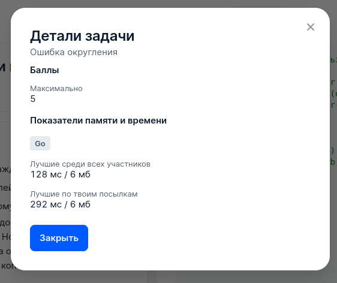

# 2 Ошибка округления

## Условие задачи
Маркетплейс получает комиссию *p%* с каждой продажи товаров. Если был продан товар, который стоил $a_i$ рублей, комиссия должна составить
$a_i⋅\frac{p}{100}$ рублей. По техническому заданию комиссия должна округляться в меньшую сторону до второго знака после запятой, то есть до целого числа копеек. Но, из-за допущенной программистом ошибки, комиссия всегда округлялась в меньшую сторону до целого числа рублей, то есть копейки отбрасывались. 

Найдите сумму, упущенную из-за ошибки, после продажи маркетплейсом *n* товаров со стоимостями $a_i$ рублей.

## Входные данные
Каждый тест состоит из нескольких наборов входных данных.

Первая строка содержит целое число *t (1 ≤ t ≤ 10<sup>5</sup>)* — количество наборов входных данных.

Далее следует описание наборов входных данных.

Первая строка каждого набора входных данных содержит два целых числа *n* и *p (1 ≤ n ≤ 10<sup>5</sup>, 1 ≤ p ≤ 10)* —
количество проданных товаров и процент комиссии маркетплейса.

Следующие *n* строк каждого набора содержат по одному целому числу *a<sub>i</sub> (1 ≤ a<sub>i</sub> ≤ 10<sup>9</sup>)*
— стоимости проданных товаров в рублях.

Гарантируется, что сумма *n* по всем наборам входных данных не превосходит *10<sup>5</sup>*.

## Выходные данные
Для каждого набора входных данных на отдельной строке выведите ответ на задачу — сумму в рублях, упущенную маркетплейсом из-за ошибки. Это число должно содержать 
**ровно** два знака после точки (количество копеек).

Комментарий к первому примеру:

В первом наборе входных данных маркетплейс должен получить *1,2,3,4 и 5* копеек комиссии, но из-за ошибки за каждый товар получено *0* копеек комиссии.

Во втором наборе входных данных маркетплейс должен получить $40⋅\frac{5}{100} = 2$ рубля комиссии, копейки из-за ошибки не потеряны.

В третьем наборе входных данных маркетплейс должен получить:
 - За первый товар $50⋅\frac{99}{100} = 49.50$ рублей комиссии, из-за ошибки упущено *50* копеек.
 - За второй товар $1⋅\frac{99}{100} = 0.99$ рублей комиссии, из-за ошибки упущено 99 копеек.

Итого упущено 50 + 99 копеек, то есть 1.49 рублей.

## Пример данных
**Входные:**
```
3
5 1
1
2
3
4
5
1 5
40
2 99
50
1
```
**Выходные:**
```
0.15
0.00
1.49
```

## Результат
 
