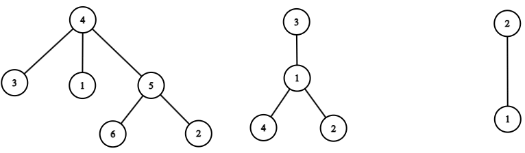

# 3 Корень дерева

## Условие задачи
Корневое дерево — абстрактная структура данных, состоящая из вершин, соединённых рёбрами. В этой структуре данных есть ровно одна вершина, называемая корнем. Каждая вершина соединена рёбрами со своими сыновьями. Каждая вершина, кроме корня, имеет ровно одного родителя. Количество рёбер дерева на *1* меньше количества его вершин.

В этой задаче вершины дерева пронумерованы числами от *1* до *n* в произвольном порядке.

Ниже приведены изображения трёх различных корневых деревьев.



У первого дерева корнем является вершина с номером 4, у второго дерева корнем является вершина с номером 3, у третьего дерева корнем является вершина с номером 2.

Закодируем дерево в виде последовательности (массива) целых чисел.

Для этого выпишем в последовательность в произвольном порядке подряд коды всех вершин. Кодом вершины *u*называется последовательность из
*d<sub>u</sub> + 2* чисел (где *d<sub>u</sub>* — количество сыновей вершины *u*): 
 - первое число кода вершины — её номер *u*,
 - второе число кода вершины — количество её детей *d<sub>u</sub>*, называемое также степенью этой вершины,
 - затем следуют *d* чисел — номера сыновей в произвольном порядке.

Обратите внимание, что как вершина, так и само дерево в общем случае может быть закодировано неоднозначно.

Например, возможный код вершины *5* для первого дерева из примера может иметь вид: *[5,2,2,6]*.

Возможные коды деревьев из примера:

 - код первого дерева: *[3,0,1,0,5,2,2,6,4,3,5,1,3,2,0,6,0]* — в этом коде записаны вершины в следующем порядке *[3,1,5,4,2,6]*;
 - код второго дерева: *[3,1,1,1,2,4,2,4,0,2,0]* — в этом коде записаны вершины в следующем порядке *[3,1,4,2]*;
 - код третьего дерева: *[1,0,2,1,1]* — в этом коде записаны вершины в следующем порядке *[1,2]*

Напишите программу, которая по коду дерева выводит номер его корня.

## Входные данные
В первой строке входных данных записано целое число *t (1 ≤ t ≤ 100)* — количество наборов входных данных.

Наборы входных данных в тесте независимы. Друг на друга они никак не влияют.

Каждый набор входных данных состоит из двух строк.

В первой из них записано целое число *m (2 ≤ m ≤ 100)* — длина последовательности, которая является кодом заданного дерева.
Во второй содержится последовательность целых чисел *a<sub>1</sub>, a<sub>2</sub>,...,a<sub>m</sub> (0 ≤ a<sub>i</sub> < 99)* — код заданного дерева.
Гарантируется, что *a* является корректным кодом некоторого корневого дерева.

## Выходные данные
Выведите *t* строк — ответы на заданные наборы входных данных: *j*-я строка должна содержать номер вершины, которая является корнем в
*j*−м наборе входных данных.

## Пример данных
**Входные:**
```
7
17
3 0 1 0 5 2 2 6 4 3 5 1 3 2 0 6 0
11
3 1 1 1 2 4 2 4 0 2 0
5
1 0 2 1 1
2
1 0
11
2 1 3 1 0 4 1 2 3 1 1
14
4 1 5 5 2 2 1 2 1 3 1 0 3 0
5
1 1 2 2 0
```
**Выходные:**
```
4
3
2
1
4
4
1
```

## Результат
 
