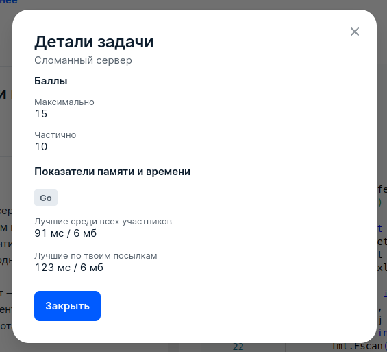

# 4 Сломанный сервер

## Условие задачи
Задана последовательность запросов к серверу от клиентов. Каждый запрос характеризуется идентификатором клиента (целое число от 1 до 10<sup>9</sup>).
Таким образом, одинаковые идентификаторы для запросов обозначают, что запросы были сделаны одним клиентом.

К сожалению, сервер не совсем работает — он может обработать запросы от не более двух различных клиентов.
Вы хотите включить его на некоторое время так, чтобы обработать максимальное количество запросов.

Какой наиболее длинный отрезок запросов (подпоследовательность идущих подряд запросов) сможет обработать сервер? Выведите длину такого отрезка запросов.

Например, если последовательность имеет вид *[7,1,4,1,9,1,1,9,1,7,9]*, то наиболее длинный отрезок запросов,
который содержит запросы от не более чем двух клиентов — это *[1,9,1,1,9,1]*. Его длина равна 6.

Обратите внимание, что искомый отрезок запросов должен содержать последовательность запросов, которые идут подряд (пропускать запросы нельзя).

Неполные решения этой задачи (например, недостаточно эффективные) могут быть оценены частичным баллом.

## Входные данные
В первой строке записано целое число *t (1 ≤ t ≤ 100)* — количество наборов входных данных в тесте.

Наборы входных данных в тесте являются независимыми. Друг на друга они никак не влияют.

Первая строка каждого набора входных данных содержит целое число *n (1 ≤ n ≤ 50)* — количество запросов.

Вторая строка набора содержит последовательность идентификаторов *a<sub>1</sub>, a<sub>2</sub>,...,a<sub>n</sub> (0 ≤ a<sub>i</sub> < 10<sup>9</sup>)*,
где *a<sub>i</sub>* — целое число, которое обозначает идентификатор клиента, совершившего *i*-й запрос.

## Выходные данные
Для каждого набора входных данных выведите положительное целое число — длину наибольшего отрезка запросов,
что в этом отрезке запросы совершали не более двух различных клиентов.

## Пример данных
**Входные:**
```
5
11
7 1 4 1 9 1 1 9 1 7 9
5
1 2 3 4 5
5
5 5 5 5 5
9
10 20 10 10 30 10 20 10 40
1
1000000000
```
**Выходные:**
```
6
2
5
4
1
```

## Результат
 
