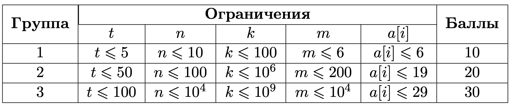

# 6 Упаковка коробок

## Условие задачи
У вас есть *n* машин, каждая грузоподъемностью *k* килограмм. Вам дали заказ доставить *m* коробок в другой город.
Известно, что вес каждой коробки является степенью двойки, отсюда *i*-я коробка весит 2<sup>a[i]</sup> килограмм.
Для транспортировки вы используете все имеющиеся *n* машин, в которые стараетесь погрузить максимальное количество груза.
Определите, за какое минимальное число транспортировок вы сможете доставить все *m* коробок.

## Входные данные
Каждый тест состоит из нескольких наборов входных данных.

Первая строка содержит целое число *t (1 ≤ t ≤ 100)* — количество наборов входных данных.

Далее следует описание наборов входных данных.

Первая строка каждого набора входных данных содержит два числа *n* и *k (1≤n≤10<sup>4</sup>, 1≤k≤10<sup>9</sup>)* — количество машин и их грузоподъемность.
 
Вторая строка каждого набора входных данных содержит число *m (1≤m≤10<sup>4</sup>)* — количество коробок.

В третьей строке каждого набора входных данных даются *m* чисел — * a[i] (0≤a[i]≤29)*, где вес *i*-й коробки равен *2<sup>a[i]</sup> (1≤2<sup>a[i]</sup>≤k).



**Разделить коробку нельзя.**

**Для одной транспортировки можно использовать до *n* машин.**

**Гарантируется, что за какое-то количество поездок все коробки могут быть доставлены.**

## Выходные данные
Выведите число — минимальное количество транспортировок, чтобы доставить все *m* коробок

В первом тесте имеется 2 машины, вес коробок, соответственно: *[1, 8, 2, 16, 8, 8]*.

В первой транспортировке на первую машину можно положить коробку *[16]*, на вторую: *[1, 8, 8]*.

Во второй транспортировке на первую машину можно положить коробку *[2]*, на вторую: *[8]*.

Можно доказать, что минимальное количество транспортировок равно 2, чтобы доставить все коробки.

## Пример данных
**Входные:**
```
1
2 17
6
0 3 1 4 3 3
```
**Выходные:**
```
2
```

## Результат
 
