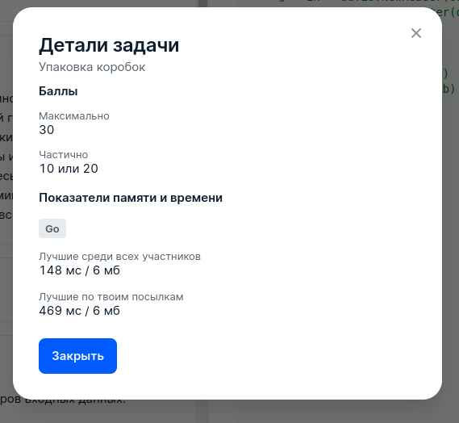

# 5 JSON prettify

## Условие задачи
Дан JSON-объект, который состоит из списков, словарей и строк.

К этому JSON-объекту нужно применить операцию prettify. Операция заключается в удалении пустых списков и словарей.
 - Если значение некоторого ключа в словаре — пустой список или словарь, то значение удаляется вместе с ключом.
 - Если элемент некоторого списка — пустой список или словарь, то элемент удаляется, а порядок остальных элементов в этом списке не изменяется.

Операция prettify применяется до тех пор, пока в JSON-объекте есть пустые словари или списки.

Выведите JSON-объект, полученный после применения операции prettify. Гарантируется что в результате работы prettify JSON-объект не станет пустым.

## Входные данные
Каждый тест состоит из нескольких наборов входных данных.

Первая строка содержит целое число *t (1 ≤ t ≤ 100)* — количество наборов входных данных.

Далее следуют описания наборов входных данных.

Первая строка каждого набора входных данных содержит целое число *n (1 ≤ n ≤ 20000)* — количество строк, на которых записан JSON-объект.

Следующие n строк каждого набора входных данных содержат JSON-объект.

Элементы JSON-объекта могут быть разделены пробелами и символами табуляции.

Гарантируется, что:
 - Суммарное количество словарей, списков и строк во всех наборах входных данных не превосходит 10000.
 - Все строки в JSON-объекте непустые, состоят из строчных латинских букв, и длина каждой строки не превосходит 10.
 - Размер теста не превосходит 1MB.

## Выходные данные
Выведите один JSON-список из *t* элементов. *i*-й элемент списка является *i*-м JSON-объектом из входных данных после применения к нему операции prettify.
При проверке ответа пробелы, символы табуляции и переносы строки не учитываются. Порядок ключей в словаре не учитывается.

Любые внешние библиотеки использовать нельзя.
 - Для работы с JSON в языке C Sharp можно пользоваться библиотекой "System.Text.Json": [лень копировать ссылки]
 - Для работы с JSON в языке Go можно пользоваться библиотекой "encoding/json": [https://pkg.go.dev/encoding/json](https://pkg.go.dev/encoding/json)

## Пример данных
**Входные:**
```
3
6
{
"a": "f",
"b": {"c": {"d": [], "e": ["ababa"]}},
"c": {"k": {}},
"d": {"d": {"e": {}}}
}
2
[{}, [], {}, 	{}, "string"  
]
3
[{"one":
	[{"two":
		[{"three":"four"}]}]}]
```
**Выходные:**
```
[{"a":"f","b":{"c":{"e":["ababa"]}}},["string"],[{"one":[{"two":[{"three":"four"}]}]}]]

```

## Результат
 
