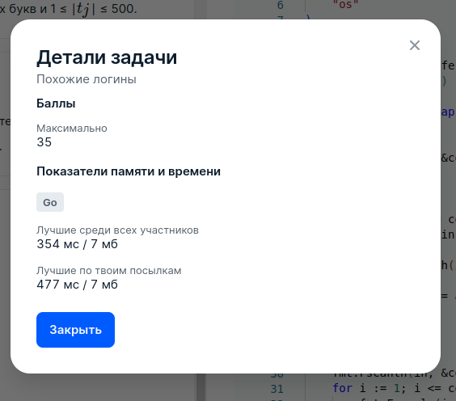

# 7 Похожие логины

## Условие задачи
При выходе на работу новому сотруднику выдают уникальный логин — строку, состоящую из строчных латинских букв.

Два логина считаются похожими, если выполняется одно из условий:
 - они совпадают;
 - в одном из логинов можно поменять местами два соседних символа, чтобы получить другой логин.

В компании работает *n* сотрудников, логин *i*-го сотрудника *s<sub>i</sub>*. В компанию хотят устроиться еще *m* сотрудников,
*j*-й хочет логин *t<sub>j</sub>*. Для каждого *j* определите, есть ли среди логинов текущих сотрудников *(s<sub>1</sub>,...,s<sub>n</sub>)*
логин, похожий на *t<sub>j</sub>*.

## Входные данные
Первая строка содержит целое число *n (1 ≤ n ≤ 1000)* — количество сотрудников компании.

*i*-я из следующих *n* строк содержит логин *i*-го сотрудника *s<sub>i</sub>*. Логины состоят из строчных латинских букв и 1≤∣s<sub>i</sub>∣≤500.

Следующая строка содержит целое число *m (1 ≤ m ≤ 50000)* — количество новых сотрудников.

*j*-я из следующих *m* строк содержит логин *j*-го нового сотрудника *t<sub>j</sub>*. Логины состоят из строчных латинских букв и 1≤∣t<sub>j</sub>∣≤500.

## Выходные данные
Выведите *m* строк. В *j*-ой строке выведите 1, если среди *{s<sub>1</sub>,...,s<sub>n</sub>}* существует логин похожий на
*t<sub>j</sub>*, иначе 0.

## Пример данных
**Входные:**
```
4
hello
ozoner
roma
anykey
7
roma
ello
zooner
ankyey
ynakey
amor
rom
```
**Выходные:**
```
1
0
1
1
0
0
0
```

## Результат
 
